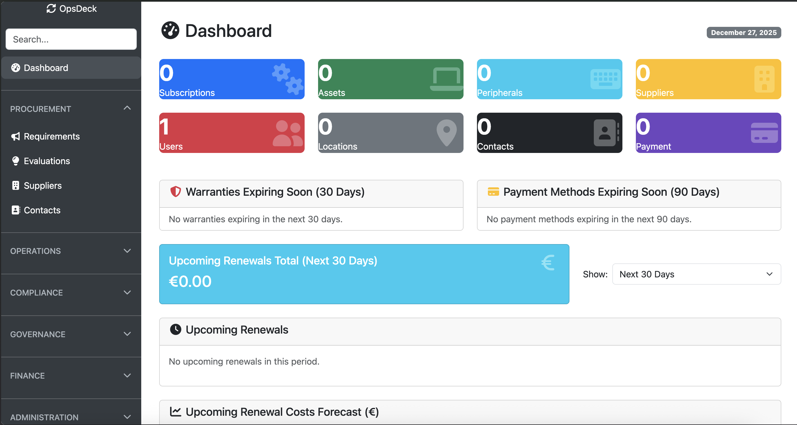

# OpsDeck

OpsDeck is an integrated IT operations and governance platform designed for teams that need operational rigor without enterprise complexity. It serves as the operational system of record for IT departments in regulated environments.



## What It Does

OpsDeck consolidates the essential operational and governance needs of IT teams into a single platform:

**Asset Lifecycle Management** - Track hardware from procurement to disposal with maintenance logs, assignment history, and warranty tracking.

**Compliance & Audit Defense** - Continuous monitoring for SOC 2 and ISO 27001 with automated evidence collection, compliance drift detection, and audit snapshots that create immutable records for auditors.

**User Access Review (UAR)** - Automated comparisons between systems to detect orphaned accounts and access mismatches. Scheduled execution with finding workflows and visual diff viewer.

**Service Catalog** - Map business services to their technical dependencies. Understand what assets and vendors support which business capabilities.

**Risk & Security Operations** - Track security incidents, maintain a risk register, manage credentials in an internal vault, and log all security activities with audit trails.

**Vendor Management** - Supplier tracking with compliance status, contract lifecycle management, and subscription renewal forecasting.

**Policy & Training** - Policy acknowledgment workflows and training assignment tracking linked to compliance controls.

Built for mid-market IT teams (50-500 employees) in finance, healthcare, SaaS, and other regulated industries.

## Quick Start

**Local Development**
```bash
# Clone and setup
git clone https://github.com/pixelotes/opsdeck.git
cd opsdeck
python3 -m venv venv
source venv/bin/activate
pip install -r requirements.txt

# Initialize database
flask db upgrade
flask init-db
flask seed-db-prod

# Run
flask run --debug
```

Access at `http://127.0.0.1:5000` with default credentials `admin@example.com` / `admin123` (you'll be prompted to change on first login).

**Docker Deployment**
```bash
docker-compose up -d --build
```

See [deployment documentation](documentation/deployment_docker.md) for production configuration including PostgreSQL, TLS, backup strategies, and monitoring.

## Tech Stack

Python 3 + Flask, SQLAlchemy ORM, Bootstrap 5, APScheduler. Supports SQLite (development) and PostgreSQL (production).

## Documentation

- [Getting Started Guide](documentation/getting_started.md) - Onboarding and core workflows
- [Architecture Overview](documentation/architecture.md) - System design and technical details
- [Use Cases](documentation/use_cases.md) - Common scenarios and target organizations
- [API Usage](documentation/api_usage.md) - REST API integration
- [FAQ](documentation/faq.md) - Common questions
- [Deployment Guides](documentation/) - Docker, manual, and Kubernetes deployment

## Key Features

**Automated User Access Reviews** - Schedule comparisons between systems (HRIS vs. IDP, AD vs. database, etc.) with automated finding detection and bulk remediation workflows.

**Compliance Drift Detection** - Daily snapshots of compliance status with automatic alerting when controls regress. Timeline visualization shows changes over configurable periods.

**Audit Defense Interface** - Create immutable compliance snapshots for audits. Link evidence continuously to controls. Export comprehensive evidence packages for auditors.

**Service Dependency Mapping** - Understand which assets, vendors, and systems support business services. Impact analysis for incidents and changes.

**Universal Search** - Search across assets, users, incidents, findings, vendors, and compliance controls with faceted filtering.

**REST API** - Programmatic access to all platform functionality with bearer token authentication. OpenAPI documentation at `/swagger-ui`.

## Enterprise Plugin

LDAP/AD integration, SAML SSO, advanced analytics, multi-tenancy, and custom branding available under separate commercial license.

## License

[Elastic License](./LICENSE) - Free to use and modify, restrictions on offering as a managed service.

---

Built for IT teams who need operational excellence without operational overhead.
